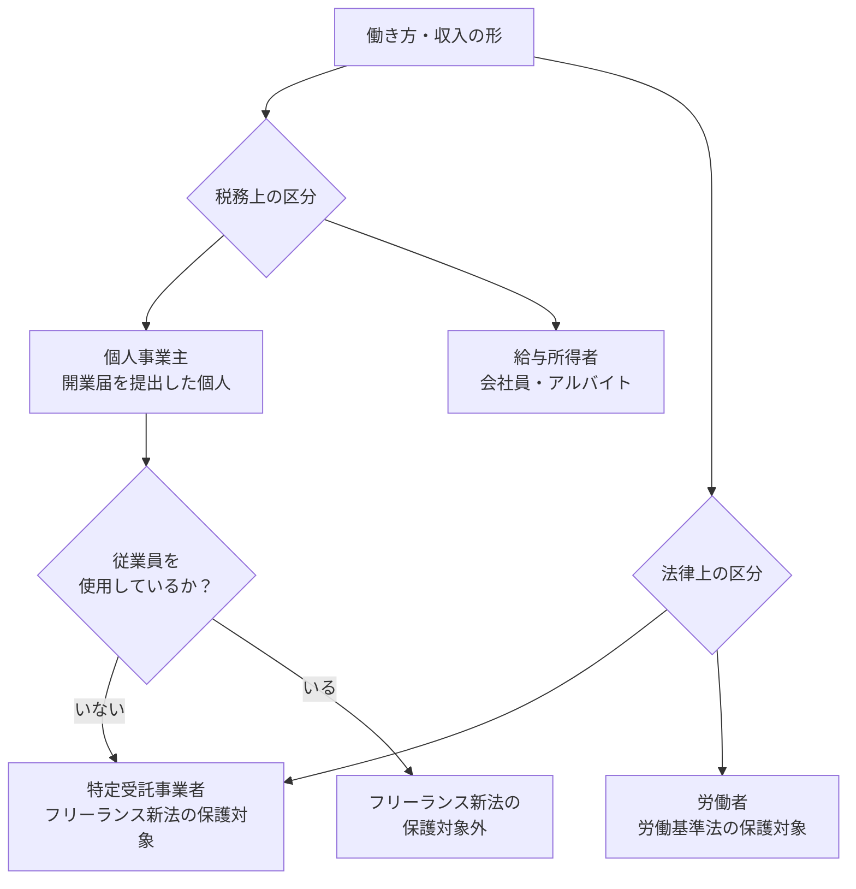
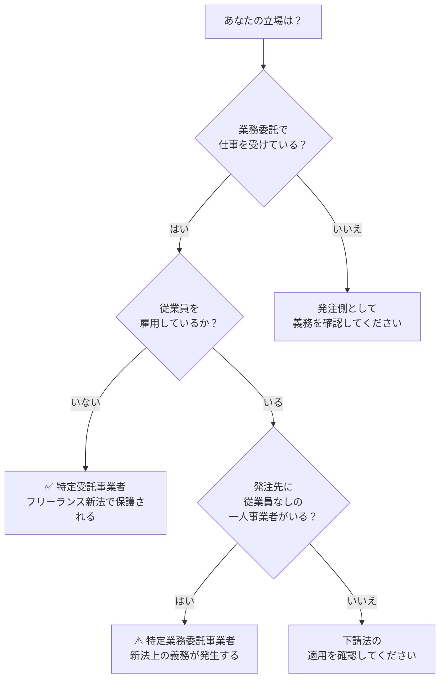

# 個人事業主とフリーランスの違い｜フリーランス新法の適用はどちらか

**メタディスクリプション：** 「自分はフリーランス新法の対象？」と迷う個人事業主・フリーランス必見。法律の定義と適用条件を条文番号付きで解説。あなたの契約が保護されるかどうか、今すぐ確認できます。

---

## 「自分はフリーランス？それとも個人事業主？」——その混乱、よくある話です

クライアントから「フリーランス新法が施行されたから契約書を見直す」と言われた。でも、自分は開業届を出している「個人事業主」だ。フリーランス新法は自分には関係ないのだろうか——。

あるいは逆に、「自分はフリーランスだから守られているはず」と思っていたら、実際の契約では何の保護も受けられなかった、というケースも起きています。

「個人事業主」と「フリーランス」は日常会話では同じ意味で使われますが、**フリーランス新法（特定受託事業者に係る取引の適正化等に関する法律）の世界では、適用対象の定義がはっきりと定められています**。自分がどちらに当たるかを正確に理解しないと、法的保護を受けられないまま不利な契約を結び続けることになります。

---

## 結論：フリーランス新法は「個人事業主か否か」ではなく「従業員がいるか否か」で決まる

税務上・社会通念上の「個人事業主」「フリーランス」という区別は、フリーランス新法の適用には関係ありません。

フリーランス新法が定める保護対象（**特定受託事業者**）の条件はたった一つ、**「業務委託を受ける個人または法人で、従業員を使用していないこと」**です（フリーランス新法第2条第1項）。

つまり、開業届の有無・屋号の有無・法人化の有無ではなく、**「一人で働いているか」**が判断基準です。

> **[→ 今の契約書の違反リスクを30秒で確認する（条文番号付きで違反箇所を特定）](https://freelance-contract-checker.vercel.app/pricing)**

---

## フリーランス新法の「定義」を条文で正確に理解する

### 特定受託事業者（保護される側）の定義

フリーランス新法第2条第1項は、特定受託事業者を以下のように定義しています。

| 項目 | 条件 |
|---|---|
| 業務形態 | 業務委託を受けて事業を行う者 |
| 雇用関係 | 従業員を使用していない |
| 組織形態 | 個人または法人（一人法人も含む） |

**ポイントは「法人でも対象になる」こと**です。一人で合同会社（LLC）や株式会社を設立していても、従業員を雇っていなければ特定受託事業者として保護されます（フリーランス新法第2条第1項）。

### 特定業務委託事業者（発注する側）の定義

発注側にも条件があります。フリーランス新法第2条第3項は、**「特定受託事業者に業務委託をする事業者であって、従業員を使用するもの」**を特定業務委託事業者と定義しています。

つまり、**一人フリーランスが別の一人フリーランスに仕事を発注する場合、この法律の義務規定（書面交付・報酬支払期日設定など）の一部は適用されません**（フリーランス新法第2条第3項）。

⚠️ <strong>注意</strong> 「フリーランスに発注しているから新法は関係ない」は誤りです。従業員を1人でも雇っている事業者が一人フリーランスに発注すれば、新法の義務が発生します（フリーランス新法第5条）。

---

## 「個人事業主」「フリーランス」という言葉はどこから来ているのか

混乱の原因は、この2つの言葉が異なるカテゴリーの分類だからです。

「個人事業主」は**税務・行政上の分類**（所得税法・開業届）です。「フリーランス」は**働き方の社会通念上の呼び名**にすぎません。

一方「特定受託事業者」は**フリーランス新法が定める法的な分類**です。日常語の「フリーランス」と完全には一致しません。

💡 <strong>ポイント</strong> 開業届を出していなくても、従業員を雇っていなければフリーランス新法の保護対象（特定受託事業者）になります。「開業届を出していないから関係ない」は誤りです（フリーランス新法第2条第1項）。

---

## あなたが「保護される側」か「義務を負う側」かを判断するフロー

> **[→ 契約書を500円でAI診断する（条文番号付きで違反箇所を特定）](https://freelance-contract-checker.vercel.app/pricing)**

### 保護される側（特定受託事業者）が持つ主な権利

フリーランス新法は保護対象に対して以下の権利を保障しています。

| 権利の内容 | 根拠条文 |
|---|---|
| 業務委託の内容・報酬の書面交付を受ける権利 | 第5条 |
| 報酬を60日以内に支払ってもらう権利 | 第6条 |
| ハラスメント対策の整備を求める権利 | 第14条 |
| 育児・介護に配慮した対応を求める権利 | 第13条 |

🚨 <strong>違反リスク</strong> 発注側が書面を交付せず口頭のみで業務委託をした場合、フリーランス新法第5条違反となり、公正取引委員会または中小企業庁による勧告・命令の対象になります。

---

## 下請法との違いも押さえておく

フリーランス新法と混同されやすいのが**下請法（下請代金支払遅延等防止法）**です。両法の適用範囲は異なります。

| 比較項目 | フリーランス新法 | 下請法 |
|---|---|---|
| 適用の基準 | 従業員の有無 | 資本金の額 |
| 保護対象 | 一人で働く事業者 | 中小企業も含む |
| 書面交付義務 | あり（第5条） | あり（第3条） |

下請法は資本金3億円超の親事業者から資本金3億円以下の下請事業者への発注に適用されます（下請法第2条）。フリーランス新法は資本金に関係なく、**従業員の有無だけで判断**します。

個人事業主・フリーランスの多くは両法の適用対象になりうるため、どちらの保護が使えるかを把握することが重要です。

✅ <strong>チェックポイント</strong> ・従業員を雇っていない → フリーランス新法の保護対象（第2条第1項） ・発注元の資本金が大きい → 下請法の保護も受けられる（下請法第2条） ・契約書に報酬額・支払期日の記載がない → 両法違反の可能性がある

---

📋 <strong>まとめ</strong> 
① フリーランス新法の保護対象は「個人事業主かどうか」ではなく「従業員がいないかどうか」で決まる（第2条第1項） 
② 開業届・屋号・法人格の有無は適用条件に関係しない 
③ 一人法人（一人合同会社など）も従業員なしなら保護対象になる 
④ 従業員を雇っている発注者がフリーランスに発注するとき、書面交付・60日以内支払い等の義務が発生する（第5条・第6条）

---

## 今すぐできること1つ

自分が保護対象だとわかっても、**現在の契約書がフリーランス新法の要件を満たしているかどうか**は別の問題です。

「書面交付はされているが、記載事項が不足している」「報酬支払期日が60日を超えている」——こうした違反は、契約書を読み込まないと発見できません。

法律の専門知識がなくても、AIが条文番号付きで違反箇所を特定し、今すぐ改善できます。

> **[→ 契約書を500円でAI診断する（条文番号付きで違反箇所を特定）](https://freelance-contract-checker.vercel.app/pricing)**