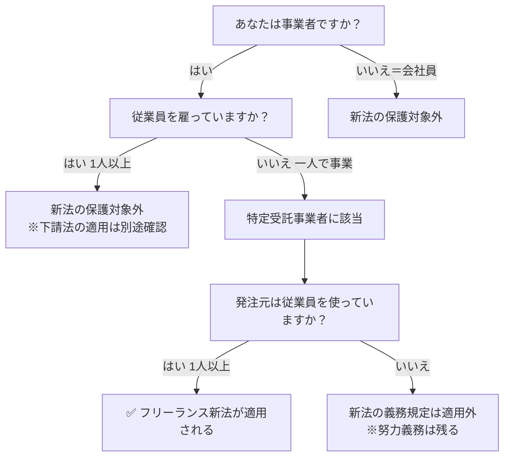

# 個人事業主とフリーランスの違い｜フリーランス新法の適用はどちらか

**メタディスクリプション：** 「自分はフリーランス新法の対象？」と迷う個人事業主・フリーランス必読。法律上の定義の違いを条文番号付きで解説し、あなたの契約が保護されるかを明確にします。

---

## 「自分はフリーランス？個人事業主？どっちが法律で守られるの？」

請負契約書にサインする直前、ふと思った経験はないですか。

「2024年に施行されたフリーランス新法、自分には関係あるのかな…」「個人事業主として開業届を出しているけど、フリーランスとは違うの？」と。

特に、副業から独立したばかりの方や、法人化を検討中の方は「自分の立場がどのカテゴリに入るのか」が曖昧なまま、不利な契約を結んでしまうケースが後を絶ちません。この記事では、法律が定める明確な定義に基づいて、あなたが新法の保護を受けられるかどうかを断定的に解説します。

---

## 結論：「個人事業主＝フリーランス」ではない。新法の保護対象はより狭く定義されている

フリーランス新法（特定受託事業者に係る取引の適正化等に関する法律）は、**「個人事業主」全員を対象にしているわけではありません**。新法第2条第1項は、保護対象を「業務委託の相手方である事業者であって、従業員を使用しないもの」と定義しており、この要件を満たす者を「特定受託事業者」と呼びます。

つまり、**従業員を1人でも雇っていれば、個人事業主であってもフリーランス新法の保護対象外**です。逆に、法人格を持たない個人でも、一人で事業を営んでいれば保護対象になります。

> **[→ 登録不要・無料で契約書をAI診断する（条文番号付きで違反箇所を特定）](https://freelance-contract-checker.vercel.app/try)**

---

## 法律上の定義を整理する：3つの概念を混同しないこと

「個人事業主」「フリーランス」「特定受託事業者」はそれぞれ異なる概念です。混同すると、自分が保護されると思っていたのに実は対象外だった、という事態が起きます。

| 用語 | 法的根拠 | 定義のポイント |
|------|---------|--------------|
| 個人事業主 | 所得税法・開業届 | 法人を設立せず事業を行う自然人。従業員の有無は問わない |
| フリーランス | 法的定義なし | 慣用的表現。法律の条文には登場しない |
| 特定受託事業者 | フリーランス新法第2条第1項 | 業務委託を受ける事業者で、**従業員を使用しない**もの（個人・法人どちらも含む） |

⚠️ <strong>注意</strong> 「フリーランス」という言葉は法律上の正式用語ではありません。フリーランス新法の条文中にも「フリーランス」という単語は登場せず、正式には「特定受託事業者」と呼ばれます。

### 「従業員を使用しない」とはどういう意味か

フリーランス新法第2条第1項が定める「従業員を使用しない」の解釈は明確です。**雇用契約を結んだ労働者が1人でもいれば、この要件を満たしません**。ただし、外注先・業務委託先はカウントされません。自分自身が発注者側として業務委託を使っているだけであれば、「従業員を使用していない」状態に該当します。

---

## フリーランス新法が適用される具体的な場面

新法が適用されるのは、「特定受託事業者（＝一人で事業を営む者）」が「特定業務委託事業者」から業務委託を受ける取引です（フリーランス新法第2条第3項）。

💡 <strong>ポイント</strong> 発注元（クライアント）側の規模によって、新法上の義務の「重さ」が変わります。従業員を使用する事業者が発注元の場合、書面交付義務（第3条）・報酬支払期日（第4条）・禁止行為（第5条）がすべて適用されます。

---

## 新法が適用されると何が変わるのか：主要な保護内容

フリーランス新法が適用される取引では、発注者側に以下の義務が課されます。違反した場合、公正取引委員会・中小企業庁による**行政指導・勧告・公表の対象**となります（フリーランス新法第13条〜第16条）。

| 条文 | 発注者の義務 | 違反した場合 |
|------|-----------|------------|
| 第3条 | 業務内容・報酬・支払期日等の書面・電磁的方法による明示 | 行政指導の対象 |
| 第4条 | 給付受領日から60日以内の報酬支払 | 勧告・公表の対象 |
| 第5条 | 受領拒否・報酬減額・不当な経済的利益の提供要請等の禁止（7項目） | 勧告・公表の対象 |
| 第12条 | ハラスメント対策体制の整備 | 行政指導の対象 |

🚨 <strong>違反リスク</strong> 口頭のみで業務委託を行い、発注内容・報酬・支払期日を書面で明示しない行為は、フリーランス新法第3条違反です。「いつもの取引だから」という慣行は通用しません。発注者は必ず書面または電磁的方法で明示する義務があります。

> **[→ 今の契約書の違反リスクを30秒で確認する（登録不要・無料）](https://freelance-contract-checker.vercel.app/try)**

---

## 下請法との違い：どちらが自分に適用されるのか

「下請法はどうなるの？」と思った方のために整理します。下請法（下請代金支払遅延等防止法）とフリーランス新法は、**適用対象が異なる別の法律**です。

✅ <strong>チェックポイント</strong> 
・下請法は「資本金の規模」で適用を判断します（下請法第2条） 
・フリーランス新法は「従業員の有無」で適用を判断します（フリーランス新法第2条） 
・両方が同時に適用される取引も存在します

一人で事業を営む個人事業主（＝特定受託事業者）が、資本金1,000万円超の会社から製造委託・情報成果物作成委託を受けた場合、**下請法とフリーランス新法の両方が適用**されます。この場合、より厳しい規制（下請法）に加えて、ハラスメント対策義務（フリーランス新法第12条）なども発注者に課されます。

---

## 「自分は対象か？」を確認するチェックリスト

📋 <strong>フリーランス新法の適用チェック（特定受託事業者側）</strong> 
□ 雇用契約を結んだ従業員がいない（外注・業務委託は除く） 
□ 法人・個人を問わず事業を営んでいる 
□ 他の事業者から業務委託を受けている 
□ 発注元は従業員を1人以上使用している  
上記4つをすべて満たす場合、あなたはフリーランス新法の保護対象です（同法第2条第1項・第3項）。

---

## 今すぐできること：契約書を1回診断する

あなたが特定受託事業者に該当すると確認できたとしても、手元の契約書が新法の要件を満たしているかどうかは別問題です。

フリーランス新法第3条が要求する「書面明示事項」（業務内容・報酬額・支払期日・給付の内容・契約期間など）がすべて記載されているか、第5条の禁止行為に該当する条項が紛れ込んでいないかを確認する必要があります。

専門家に頼む前に、まず手元の契約書を無料でAI診断してみてください。条文番号付きで違反箇所を特定できます。

> **[→ 無料で1回、契約書を守る（登録不要・専門知識不要）](https://freelance-contract-checker.vercel.app/try)**

今すぐできることは1つです。**現在手元にある業務委託契約書をアップロードして、30秒でリスクを確認すること**。それだけで、不当な契約条件を見過ごすリスクを大幅に減らせます。