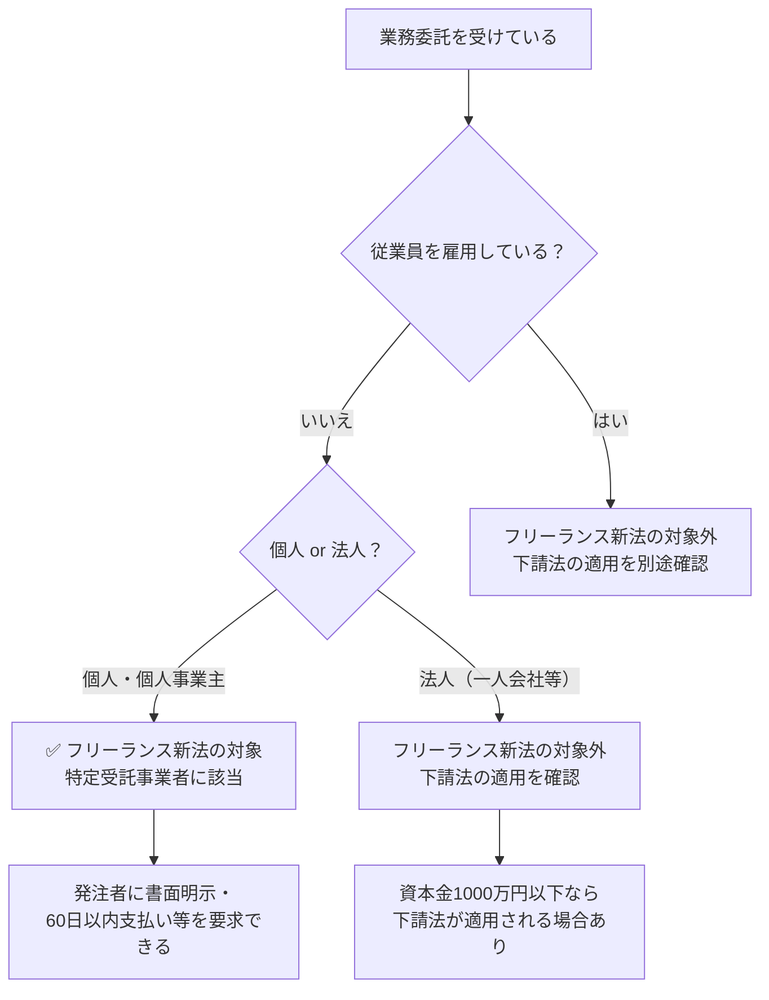

# 個人事業主とフリーランスの違い｜フリーランス新法の適用はどちらか

**メタディスクリプション：** 「自分はフリーランス新法の対象？」と迷う個人事業主・フリーランス必読。法律上の定義と適用条件を条文番号付きで完全解説。契約書の違反リスクも診断できます。

---

## 「自分には関係ない話かな…」と思って損していませんか？

確定申告を「個人事業主」として毎年やっている。でも仕事の受け方は完全にフリーランス。クライアントから「業務委託契約書」を渡されても、それが適法かどうか判断できない——。

2024年11月に施行された**フリーランス新法（特定受託事業者に係る取引の適正化等に関する法律）**。ニュースで名前は聞いたけれど、「個人事業主の自分は対象なのか、フリーランスと呼ばれる人だけが対象なのか」がわからないまま、不利な契約書にサインし続けているケースが後を絶ちません。

---

## 結論：フリーランス新法は「個人事業主」も対象です

法律上、「個人事業主」と「フリーランス」は**別の概念ではなく、重複して適用される**ものです。フリーランス新法が保護する「特定受託事業者」には、個人事業主として届け出た人も含まれます（フリーランス新法第2条第1項）。

「フリーランスじゃないから関係ない」は完全な誤解です。

> **[→ 今の契約書の違反リスクを30秒で確認する（条文番号付きで違反箇所を特定）](https://freelance-contract-checker.vercel.app/pricing)**

---

## そもそも「個人事業主」と「フリーランス」は何が違うのか

### 法律上の定義を確認する

「個人事業主」と「フリーランス」は、**定義する法律が異なります**。混同されやすいですが、整理すると以下のとおりです。

| 用語 | 定義する法律・根拠 | 意味 |
|------|-------------------|------|
| 個人事業主 | 所得税法・税法上の区分 | 法人を設立せず事業を行う個人 |
| 特定受託事業者（フリーランス） | フリーランス新法第2条第1項 | 従業員を使わず業務委託を受ける事業者 |
| 特定業務委託事業者（発注側） | フリーランス新法第2条第3項 | フリーランスに業務を委託する事業者 |

ポイントは、フリーランス新法が使う言葉は「フリーランス」ではなく**「特定受託事業者」**だという点です（フリーランス新法第2条第1項）。この定義には**「業務委託の相手方である事業者であって、従業員を使用しないもの」**と明記されており、法人格の有無ではなく「従業員がいるかどうか」が適用の分かれ目です。

💡 <strong>ポイント</strong> フリーランス新法の適用条件は「フリーランスと名乗っているか」ではなく、「従業員を雇用せず業務委託を受けているか」です（フリーランス新法第2条第1項）。個人事業主として開業届を出していても、従業員なしで業務委託を受けていれば保護対象です。

---

## フリーランス新法で発注者に課される主な義務

自分が保護対象だとわかったら、次に「発注者が何をしなければならないか」を把握することが重要です。

### 発注者の義務一覧

フリーランス新法は発注者（特定業務委託事業者）に対して、以下の義務を課しています。

| 義務の内容 | 根拠条文 | 具体的な内容 |
|-----------|---------|------------|
| 書面等での取引条件明示 | 第3条第1項 | 業務内容・報酬額・支払期日を書面またはメールで事前明示 |
| 報酬の60日以内支払い | 第4条 | 給付を受けた日から60日以内に報酬を支払う義務 |
| 募集情報の正確表示 | 第12条 | 虚偽・誇大な業務委託の募集情報を掲載してはならない |
| ハラスメント対策 | 第14条 | ハラスメント防止のための体制整備義務 |
| 中途解除の事前予告 | 第16条 | 継続的業務委託を中途解除する場合、30日前までの予告義務 |

🚨 <strong>違反リスク</strong> 発注者がフリーランス新法第3条の書面明示義務に違反した場合、公正取引委員会・厚生労働大臣・中小企業庁長官による勧告・命令・公表の対象となります（フリーランス新法第25条〜第27条）。あなたが受け取った契約書に取引条件の記載が不十分な場合、それ自体が違法状態です。

---

## 「自分は一人会社（法人）だから対象外では？」という疑問

一人で法人を設立している場合（いわゆる「マイクロ法人」）は、フリーランス新法の対象外です。フリーランス新法第2条第1項は「**事業者であって、従業員を使用しないもの**」と規定していますが、法人格を持つ場合は同条の「個人」に該当しないと解釈されます。

ただし、法人であっても**下請法（下請代金支払遅延等防止法）の適用対象となる場合があります**（下請法第2条）。資本金1000万円以下の法人が親事業者から業務委託を受ける場合などは下請法が適用されるため、「法人だから何も守られない」とは限りません。

> **[→ 契約書を500円でAI診断する（条文番号付きで違反箇所を特定）](https://freelance-contract-checker.vercel.app/pricing)**

---

## 適用対象と確認すべき契約書の違反パターン

フリーランス新法の対象であるとわかったら、手元の契約書に以下の違反が含まれていないか確認する必要があります。

⚠️ <strong>注意</strong> 以下の条件が契約書に含まれている場合、フリーランス新法または下請法の違反に該当します。発注者に是正を求める権利があります。

### 契約書でよく見られる違反パターン

**① 支払期日が「検収後90日」など60日を超えている**
→ フリーランス新法第4条違反。給付受領日から60日以内の支払いが義務です。

**② 業務内容・報酬額が口頭のみで書面に残っていない**
→ フリーランス新法第3条第1項違反。書面またはメールでの事前明示が義務です。

**③「一方的な都合による即時解除」条項がある**
→ 継続的業務委託の中途解除は30日前までの予告が義務です（フリーランス新法第16条第1項）。

**④ 成果物の修正を何度でも無償で求める条項がある**
→ 報酬の減額・不当な経済上の利益提供要求は禁止です（フリーランス新法第5条第5号・第7号）。

✅ <strong>チェックポイント</strong> 契約書に「支払期日」「業務内容の具体的記載」「解除条項」「修正対応の範囲と報酬」の4項目が明記されているか確認してください。1つでも欠けていれば、フリーランス新法第3条または第5条の違反に該当します。

---

## 今すぐできること1つ

個人事業主でもフリーランスでも、従業員なしで業務委託を受けているなら**フリーランス新法の保護対象です**。そして、今あなたが持っている契約書には、知らないうちに違法条項が含まれている可能性があります——いえ、**統計的に見て違反条項が含まれている契約書の方が多い状態**です。

法律を一から読み込む必要はありません。今すぐ契約書を診断ツールに読み込ませるだけで、条文番号付きで「どこが違反か」「どう直すべきか」が明確になります。

📋 <strong>まとめ</strong> 
・「個人事業主」は税法上の区分、「特定受託事業者」はフリーランス新法上の区分（第2条第1項） 
・従業員なしで業務委託を受ける個人事業主は全員フリーランス新法の対象 
・発注者には書面明示（第3条）・60日以内支払い（第4条）・30日前解除予告（第16条）等の義務がある 
・一人法人は対象外だが下請法の適用を別途確認する必要がある

> **[→ 500円で契約書を守る（専門知識不要・条文番号付きで違反箇所を特定）](https://freelance-contract-checker.vercel.app/pricing)**