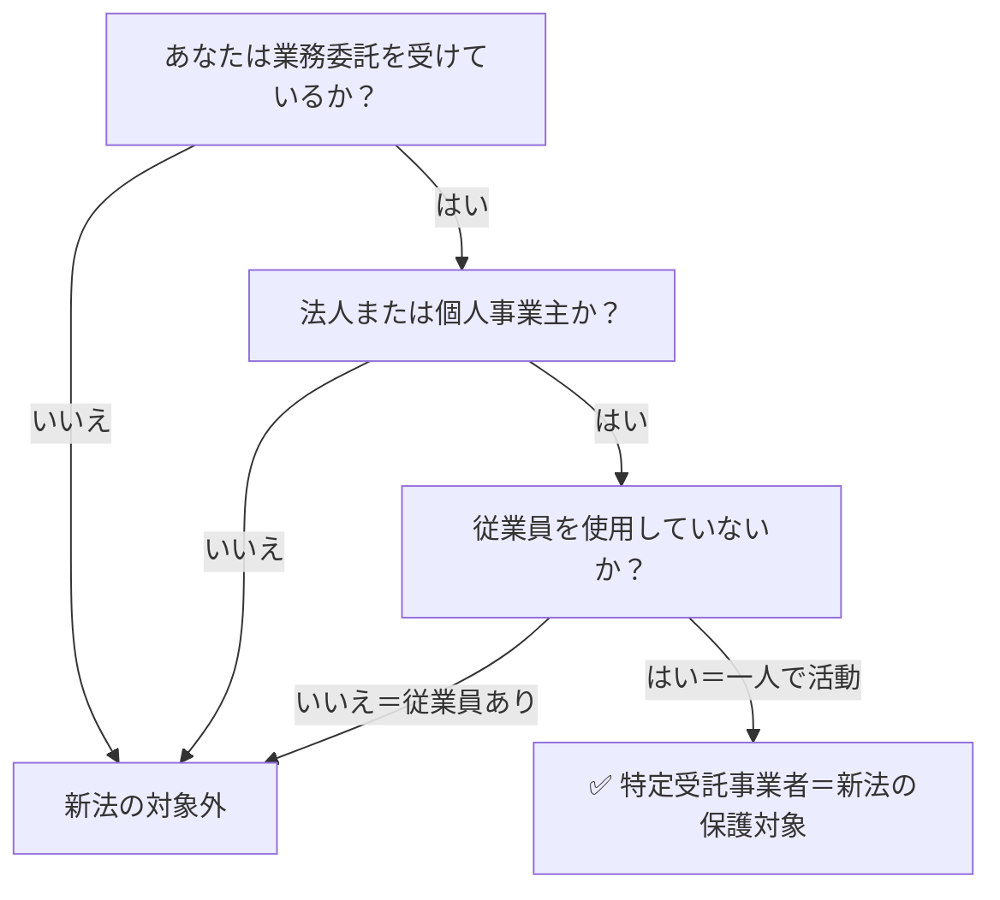
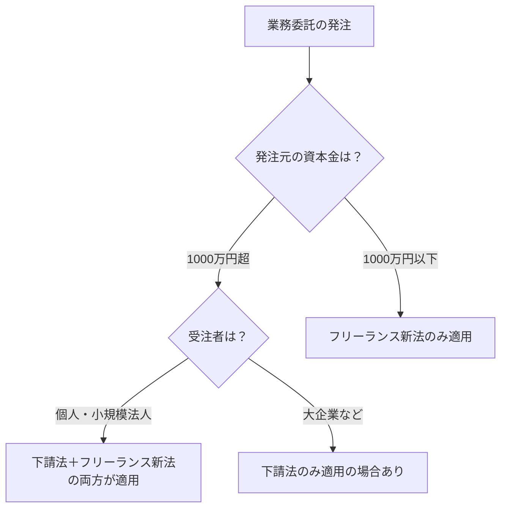

# 個人事業主とフリーランスの違い｜フリーランス新法の適用はどちらか

**メタディスクリプション：** 「自分はフリーランス新法の対象なのか？」と疑問に思う個人事業主・フリーランス必見。法律の定義の違いと適用条件を条文番号付きで徹底解説します。

---

## 「自分はフリーランス新法の対象になるの？」

確定申告を「個人事業主」として行っているあなた。取引先から「フリーランス新法が施行されたらしいけど、うちとの契約は関係ないよね」と言われて、思わず「えっ、本当に？」と感じた経験はないでしょうか。

あるいは逆に、発注担当者として「うちはフリーランスじゃなく個人事業主と契約しているから、新法の義務は発生しない」と判断しているケースもあります。

この誤解は非常に危険です。**「個人事業主だから対象外」は完全な間違いです。**

---

## 結論：「フリーランス」と「個人事業主」は法律上ほぼ同じ人を指す

フリーランス新法（特定受託事業者に係る取引の適正化等に関する法律、以下「フリーランス新法」）における「フリーランス＝特定受託事業者」の定義は、業務委託の相手方である**業務委託事業者のうち、従業員を使用しない個人または法人**です（フリーランス新法第2条第1項）。

つまり、税務署に個人事業主として登録しているかどうかは、フリーランス新法の適用とは**無関係**です。従業員を雇っていない一人で活動する事業者であれば、「個人事業主」という肩書きに関わらず、フリーランス新法の保護対象になります。

> **[→ 今の契約書の違反リスクを30秒で確認する（条文番号付きで違反箇所を特定）](https://freelance-contract-checker.vercel.app/pricing)**

---

## 「個人事業主」と「フリーランス」の言葉の違いを整理する

まず、それぞれの言葉の出どころを確認しましょう。

| 用語 | 定義の出どころ | 主な使われ方 |
|------|-------------|------------|
| 個人事業主 | 税法・社会保険法 | 開業届・確定申告の区分 |
| フリーランス | 慣用的な職業表現 | 働き方・契約形態を示す俗称 |
| 特定受託事業者 | フリーランス新法第2条第1項 | 法律上の保護対象の定義 |

「個人事業主」は税務上の区分であり、「フリーランス」は俗称です。どちらも法律が定める明確な資格や要件ではありません。フリーランス新法が定める保護対象は「**特定受託事業者**」という独自の概念であり、これが実質的に「フリーランス」に相当します。

---

## フリーランス新法が定める「特定受託事業者」の3つの条件

フリーランス新法第2条第1項は、保護対象となる「特定受託事業者」を以下のように定めています。

この3条件を満たせば、個人事業主として開業届を出していても、法人格（一人会社）であっても、フリーランス新法の保護対象になります（フリーランス新法第2条第1項）。

💡 <strong>ポイント</strong> 一人会社（代表者1名で従業員なしの合同会社・株式会社）も「特定受託事業者」に該当します。「法人だから対象外」という思い込みは危険です（フリーランス新法第2条第1項）。

---

## 発注側（特定業務委託事業者）の義務は何が変わるか

フリーランス新法は、発注側（特定業務委託事業者）にも明確な義務を課しています。特に重要な義務は以下のとおりです。

| 義務の内容 | 根拠条文 | 違反した場合 |
|-----------|---------|------------|
| 書面・電磁的方法による取引条件の明示 | 第3条第1項 | 50万円以下の罰金 |
| 報酬の60日以内の支払い | 第4条第1項 | 50万円以下の罰金 |
| ハラスメント対策の整備 | 第14条 | 行政指導・勧告の対象 |
| 募集情報の正確表示義務 | 第12条 | 行政指導・勧告の対象 |

🚨 <strong>違反リスク</strong> 「相手が個人事業主だから書面を出さなくていい」と判断した発注担当者は、フリーランス新法第3条違反となり、50万円以下の罰金の対象です。従業員を使用していない個人への業務委託であれば、必ず書面交付義務が発生します。

> **[→ 契約書を500円でAI診断する（条文番号付きで違反箇所を特定）](https://freelance-contract-checker.vercel.app/pricing)**

---

## 下請法との違い：どちらが適用されるかの判断

「下請法は知っている。フリーランス新法との違いは？」という疑問も多く聞かれます。両法律の適用関係を整理します。

⚠️ <strong>注意</strong> 下請法と フリーランス新法は競合ではなく、**重複して適用される**場合があります。発注元の資本金が一定規模以上で、かつ受注者が「特定受託事業者」に該当する場合、両方の義務を同時に守る必要があります。

フリーランス新法は資本金要件を設けていないため、中小企業・スタートアップが個人に発注する場合でも適用されます（フリーランス新法第2条第2項）。これは下請法が資本金規模による適用対象を絞っているのと大きく異なる点です。

---

## よくある誤解TOP3

✅ <strong>チェックポイント</strong> 
以下の3つの誤解をしていないか、今すぐ確認してください。  
❌ 誤解①：「開業届を出していないフリーランスは対象外」 
→ 正しくは：開業届の有無は無関係。実態として業務委託を受け、従業員がいなければ対象です（フリーランス新法第2条第1項）。  
❌ 誤解②：「副業フリーランスは対象外」 
→ 正しくは：本業・副業の区別なく、業務委託契約を締結し従業員を使用していなければ対象です。  
❌ 誤解③：「法人化したフリーランスは対象外」 
→ 正しくは：一人会社（従業員なし）であれば、法人であっても「特定受託事業者」に該当します（フリーランス新法第2条第1項）。

---

📋 <strong>まとめ</strong> 
・「個人事業主」と「フリーランス」の区別は税務上の話であり、フリーランス新法の適用とは無関係 
・フリーランス新法の保護対象は「特定受託事業者」＝従業員を使用しない個人または法人（第2条第1項） 
・発注側は書面交付（第3条）・60日以内の支払い（第4条）などの義務を負う 
・下請法とフリーランス新法は重複適用される場合がある（第2条第2項） 
・開業届の有無・本業副業の区別・法人格の有無は適用判断に関係しない

---

## 今すぐできること1つ

あなたが今使っている契約書に、フリーランス新法第3条が求める「取引条件の明示事項」がすべて盛り込まれているかを確認してください。

確認すべき記載事項は、業務内容・報酬額・支払期日・業務完了期日など7項目（フリーランス新法第3条第1項各号）にわたります。1つでも欠けていれば、それだけで法違反です。

専門家に相談する時間も費用もないという方は、AIによる契約書診断ツールを使えば**500円・30秒**で条文番号付きの違反箇所レポートが手に入ります。

> **[→ 500円で契約書を守る（専門知識不要・条文番号付き診断）](https://freelance-contract-checker.vercel.app/pricing)**

契約書1枚を診断する500円が、50万円の罰金リスクを回避する最も確実な一手です。