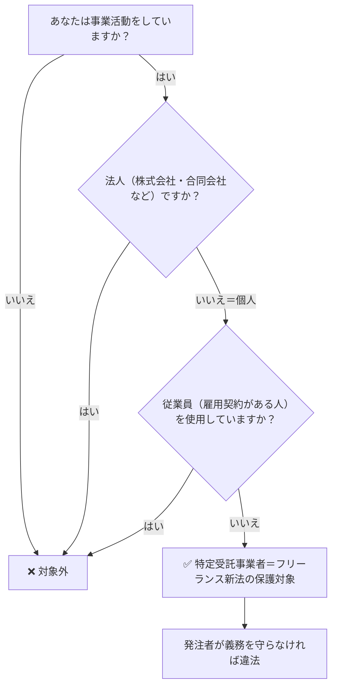

# 個人事業主とフリーランスの違い｜フリーランス新法の適用はどちらか

**メタディスクリプション：** 「私はフリーランス新法の対象？」と疑問を持つあなたへ。個人事業主とフリーランスの定義の違いを条文ベースで解説。新法が適用されるのはどちらか、今すぐ確認できます。

---

## あなたは「適用外」だと思って損をしていないか

「自分は個人事業主として開業届を出しているから、フリーランス新法は関係ない」——そう思って、報酬の支払い遅延や一方的な発注キャンセルを泣き寝入りしていませんか。

あるいは逆に、「フリーランスとして活動しているけど、法人化していないし正式な契約書もないから、保護してもらえるのか不安…」と感じていませんか。

この混乱の原因はシンプルです。**「個人事業主」と「フリーランス」の定義が、法律と一般用語でズレているから**です。このズレを知らないまま仕事を続けると、受けられるはずの保護を受けられず、不利な取引を強いられ続けることになります。

---

## 結論：フリーランス新法は「個人事業主」も「フリーランス」も、条件を満たせば適用される

結論から断言します。**フリーランス新法（特定受託事業者に係る取引の適正化等に関する法律）は、「個人事業主」か「フリーランス」かという呼び名では区別しません。**

適用の判断基準は**「特定受託事業者」に該当するかどうか**（フリーランス新法第2条第1項）、これ一点です。

> **[→ 契約書を500円でAI診断する（条文番号付きで違反箇所を特定）](https://freelance-contract-checker.vercel.app/pricing)**

---

## 「個人事業主」と「フリーランス」は何が違うのか

まず、それぞれの言葉の意味を整理します。

| 用語 | 定義の出所 | 意味 |
|---|---|---|
| 個人事業主 | 税法・社会保険法 | 法人を設立せず個人で事業を行う者 |
| フリーランス | 一般用語（慣用的） | 特定の企業に属さず独立して働く人 |
| 特定受託事業者 | フリーランス新法第2条第1項 | 法人化しておらず従業員を雇用していない事業者 |

日常会話では「フリーランス＝個人事業主」のように使われますが、税法上の「個人事業主」には、従業員を多数雇っている個人商店主なども含まれます。一方でフリーランス新法が定義する**「特定受託事業者」は、①法人でない、②従業員を使用しない、という2つの条件を満たす者**と明確に定められています（フリーランス新法第2条第1項）。

💡 <strong>ポイント</strong> 開業届の有無・屋号の有無・確定申告の種類（白色・青色）は一切関係ありません。「一人で仕事している個人」であれば、ほぼ全員が特定受託事業者に該当します。

---

## フリーランス新法の「適用対象者」を判断するフローチャート

自分が新法の保護対象かどうか、以下のフローで確認できます。

このフローチャートが示す通り、**「個人事業主」という肩書きを持つ人でも、従業員を雇っていなければ特定受託事業者として新法の保護を受けます。** 反対に、「フリーランス」と名乗っていても、従業員を1人でも雇用していれば対象外です。

---

## 発注者側（特定業務委託事業者）にも条件がある

フリーランス新法は、受注側（フリーランス）だけでなく**発注側にも適用条件**があります。

発注者は「業務委託事業者」（フリーランス新法第2条第3項）に該当しますが、そのうち**継続的業務委託（1か月を超える期間の取引）を行う発注者は「特定業務委託事業者」と定義され（フリーランス新法第2条第4項）、より厳しい義務**が課されます。

⚠️ <strong>注意</strong> 発注者が個人事業主であっても、フリーランスに業務を委託すれば「業務委託事業者」として義務を負います。「自分もフリーランスだから関係ない」という認識は誤りです（フリーランス新法第2条第3項）。

発注者に課される主な義務は以下の通りです。

| 義務の種類 | 内容 | 根拠条文 |
|---|---|---|
| 書面等による明示 | 報酬額・支払期日などを書面で明示 | 第3条 |
| 報酬支払期日の設定 | 給付受領日から60日以内に支払期日を設定 | 第4条 |
| 禁止行為 | 受領拒否・減額・一方的解除などの禁止 | 第5条 |

🚨 <strong>違反リスク</strong> 発注者が第5条の禁止行為（報酬の不当減額・一方的キャンセルなど）を行った場合、公正取引委員会・中小企業庁・厚生労働省による指導・勧告・公表の対象となります（フリーランス新法第13条・第14条）。

> **[→ 今の契約書の違反リスクを30秒で確認する](https://freelance-contract-checker.vercel.app/pricing)**

---

## 「法人化したら保護されなくなる」は本当か

フリーランスが事業拡大のために**一人会社（合同会社・株式会社）を設立した瞬間、特定受託事業者の定義から外れます**（フリーランス新法第2条第1項）。従業員ゼロの一人社長であっても、法人格を持った時点で新法の保護対象外となります。

これは新法が「個人の働き方の脆弱性」を保護対象とした立法趣旨によるもので、法人は別途、下請代金支払遅延等防止法（下請法）の適用を検討することになります。

✅ <strong>チェックポイント</strong> 
・現在：個人＋従業員なし → フリーランス新法の保護対象 
・法人化後：一人会社でも → フリーランス新法の対象外。下請法を確認 
・法人化後も：下請法の資本金要件を満たせば下請法が適用される

---

## まとめ

📋 <strong>まとめ</strong> 
① 「個人事業主」「フリーランス」という呼び名は新法の適用に無関係 
② 判断基準は「法人でない」かつ「従業員を雇っていない」の2点のみ（第2条第1項） 
③ 条件を満たせば、開業届なし・屋号なしでも保護される 
④ 法人化した瞬間に対象外となるため、タイミングに注意が必要 
⑤ 発注者側も、個人事業主であれば義務を負う（第2条第3項）

---

## 今すぐできること1つ：手元の契約書を診断する

あなたが特定受託事業者に該当すると分かった今、次にすべきことは**手元の契約書がフリーランス新法の義務事項を満たしているかどうかを確認すること**です。

第3条が要求する「書面による明示事項」が抜けていないか、第5条の禁止行為に相当する条文が含まれていないか——これらを一つひとつ手作業でチェックするには専門知識が必要です。

しかし、たった500円・30秒で、条文番号付きの違反箇所レポートを受け取ることができます。

> **[→ 契約書を500円でAI診断する（条文番号付きで違反箇所を特定）](https://freelance-contract-checker.vercel.app/pricing)**

「自分は対象外だと思っていた」という思い込みが、最も高くつく判断ミスです。今日、それを終わりにしてください。