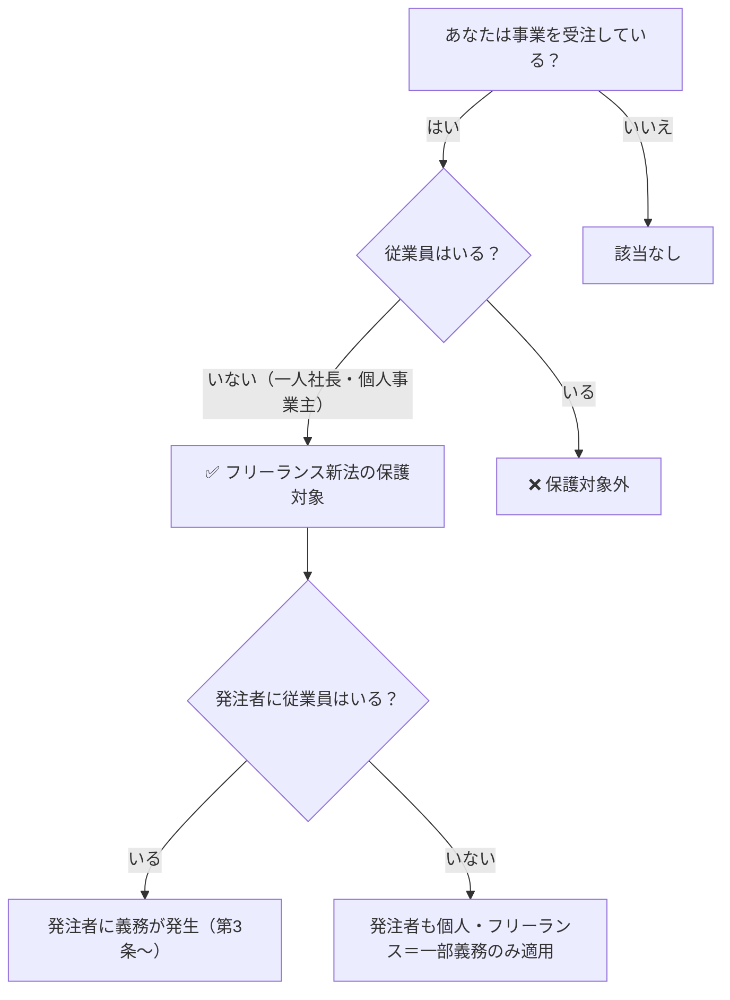

# 個人事業主とフリーランスの違い｜フリーランス新法の適用はどちらか

**メタディスクリプション：** 「自分はフリーランス新法の対象？」と疑問に思っている個人事業主・フリーランス必見。法律上の定義と適用条件を条文番号付きで解説。契約書に違反がないか今すぐ確認できます。

---

## 「自分はフリーランス新法の対象なのか？」その疑問、放置は危険です

クライアントから「うちは発注先が多いから、フリーランス新法は関係ないよ」と言われた。あるいは逆に、自分が「個人事業主登録していないからフリーランス新法は適用されない」と思って、おかしな契約書にサインしてしまった——そんな経験はありませんか。

「個人事業主」と「フリーランス」。日常会話では混同されがちなこの2つの言葉ですが、**法律上の扱いは明確に異なります**。どちらに該当するかによって、法的保護の範囲が大きく変わります。間違った理解のまま契約を続けると、代金未払いや一方的な契約変更を受けても「泣き寝入り」するしかない状況に追い込まれます。

---

## 結論：フリーランス新法は「個人事業主かどうか」ではなく「従業員を使っているかどうか」で適用が決まる

フリーランス新法（特定受託事業者に係る取引の適正化等に関する法律）の適用対象は、**「個人事業主か法人か」という区分ではありません**。

法律上の定義は以下の通りです（フリーランス新法第2条第1項）。

> **特定受託事業者＝業務委託の相手方である事業者であって、従業員を使用しないもの**

つまり、**確定申告の形式（個人か法人か）に関係なく、「従業員を雇っていない一人で働く事業者」であればフリーランス新法の保護対象**です。

> **[→ 契約書を500円でAI診断する（条文番号付きで違反箇所を特定）](https://freelance-contract-checker.vercel.app/pricing)**

---

## 「個人事業主」と「フリーランス」の定義の違いを整理する

💡 <strong>ポイント</strong> 「個人事業主」は税務・会計上の区分、「フリーランス（特定受託事業者）」は取引・契約上の法的区分です。この2つは別の軸で使われています。

### 税務・行政上の「個人事業主」とは

個人事業主とは、**法人を設立せずに個人として事業を営む者**を指します。開業届（所得税法第229条）を税務署に提出することで正式に認定されますが、提出しなくても事業実態があれば個人事業主として扱われます。

### フリーランス新法上の「フリーランス（特定受託事業者）」とは

フリーランス新法第2条第1項では、保護対象を以下のように定義しています。

| 区分 | 条件 |
|------|------|
| 個人の場合 | 従業員を使用していない |
| 法人の場合 | 代表者1名のみ・従業員なし |

つまり、**一人社長（合同会社・株式会社含む）でも従業員ゼロならフリーランス新法の対象**です。反対に、個人事業主であっても従業員を雇っていれば対象外です。

---

## フリーランス新法が適用される「特定業務委託事業者」側の条件

⚠️ <strong>注意</strong> フリーランス新法の義務は「発注する側（特定業務委託事業者）」に課されます。発注者が個人事業主・フリーランスであっても、従業員を使用していれば義務が発生します。

発注側（特定業務委託事業者）の定義はフリーランス新法第2条第3項に定められており、**従業員を使用して事業を行う者**が該当します。

具体的には以下のような義務が課されます。

| 義務の種類 | 根拠条文 | 内容 |
|-----------|----------|------|
| 書面交付義務 | 第3条 | 発注時に報酬・納期等を書面で明示する義務 |
| 報酬支払義務 | 第4条 | 成果物受領後60日以内に報酬を支払う義務 |
| ハラスメント対策 | 第14条 | 就業環境を害する行為への対策義務 |
| 中途解除の事前予告 | 第16条 | 6ヶ月以上の契約の解除は30日前予告が必要 |

🚨 <strong>違反リスク</strong> 書面交付義務（第3条）に違反した場合、公正取引委員会・中小企業庁から勧告・命令・企業名公表の対象となります（第25条・第26条）。

---

## よくある誤解：「法人化したらフリーランス新法は適用されない」は間違い

```mermaid
flowchart TD
    A[あなたは事業を受注している？] -->|はい| B{従業員はいる？}
    B -->|いない（一人社長・個人事業主）| C[✅ フリーランス新法の保護対象]
    B -->|いる| D[❌ 保護対象外]
    A -->|いいえ| E[該当なし]
    C --> F{発注者に従業員はいる？}
    F -->|いる| G[発注者に義務が発生（第3条〜）]
    F -->|いない| H[発注者も個人・フリーランス＝一部義務のみ適用]
```

このフローの通り、**法人格の有無は関係ありません**。一人で事業を運営している限り、株式会社・合同会社・個人事業主を問わず保護対象（特定受託事業者）に該当します（フリーランス新法第2条第1項）。

「法人化したから新法の保護を受けられなくなった」と誤解して、不当な契約条件を受け入れてしまうケースが後を絶ちません。これは明確な誤りです。

> **[→ 今の契約書の違反リスクを30秒で確認する](https://freelance-contract-checker.vercel.app/pricing)**

---

## 下請法との違い：どちらが自分に適用されるか

フリーランスへの発注には、フリーランス新法だけでなく**下請法（下請代金支払遅延等防止法）**も関わります。両者の違いを整理しておくことが重要です。

| 比較項目 | フリーランス新法 | 下請法 |
|---------|----------------|--------|
| 受注者の条件 | 従業員なし（法人・個人問わず） | 資本金規模で判断 |
| 発注者の条件 | 従業員を使用する事業者 | 資本金規模で判断 |
| 対象取引 | 業務委託全般 | 製造・情報成果物等に限定 |

✅ <strong>チェックポイント</strong> フリーランス新法と下請法は「重複適用」されることがあります。両方に違反している契約書も多く、個別に確認が必要です。

下請法では、親事業者（資本金1,000万円超）が個人事業主・中小フリーランスに発注する場合、支払期日は納品後60日以内と定められています（下請法第2条の2）。フリーランス新法第4条も同様に60日以内の支払いを義務付けており、**両法が重なる場合は両方の義務を果たす必要があります**。

---

## 今すぐできること1つ：契約書を確認する

📋 <strong>まとめ</strong> 
・フリーランス新法の適用は「個人事業主か否か」ではなく「従業員の有無」で決まる（第2条第1項） 
・一人社長・一人フリーランスは法人格に関わらず保護対象 
・発注者に従業員がいれば、書面交付・60日以内支払い・ハラスメント対策等の義務が発生（第3〜16条） 
・下請法との重複適用に注意

自分がフリーランス新法の保護対象と分かった今、次に確認すべきは「今手元にある契約書が法律の要件を満たしているか」です。

第3条が求める書面記載事項（報酬額・支払期日・業務内容・納期など）が契約書に入っていない場合、発注者は違法状態にあります。あなたには正当に記載を求める権利があります。

契約書を1枚アップロードするだけで、条文番号付きの違反箇所を特定できます。専門知識は一切不要です。

> **[→ 500円で契約書を守る（専門知識不要・条文番号付きで違反箇所を特定）](https://freelance-contract-checker.vercel.app/pricing)**