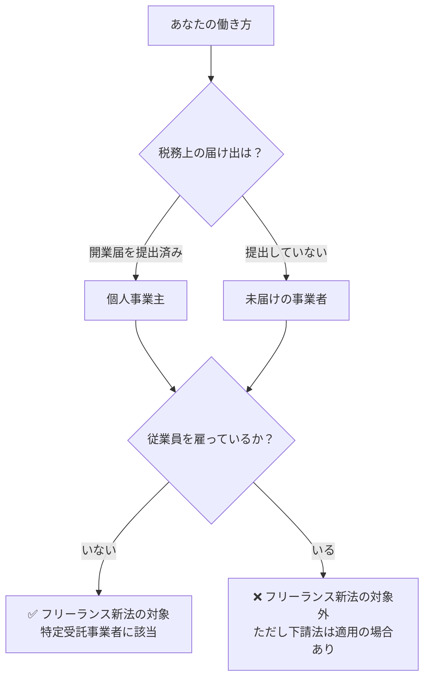

# 個人事業主とフリーランスの違い｜フリーランス新法の適用はどちらか

**メタディスクリプション：** 「自分はフリーランス新法の対象なの？」と迷う個人事業主・フリーランス必見。法律の定義・適用条件を条文番号付きで完全解説。あなたが守られているかどうか、今すぐ確認できます。

---

## 「自分はフリーランス新法に守られているのか？」その疑問、今日終わりにします

確定申告で「個人事業主」として届けを出している。でも、仕事の現場では「フリーランス」と名乗っている。

クライアントから「フリーランス新法が変わったらしい」と聞いて、慌てて調べてみたけれど、「特定受託事業者」「業務委託」「従業員を使用しない」……難しい言葉が並んでいて、**結局自分に適用されるのかどうかわからない**。

そんな状態で、今日も報酬の支払いが遅れている契約書にサインしてしまっている——これが多くのフリーランスの実態です。

この記事では、個人事業主とフリーランスの違い、そしてフリーランス新法がどちらに適用されるのかを、条文番号を根拠として明確に解説します。

---

## 結論：「フリーランス」と「個人事業主」は別の概念です。フリーランス新法の対象は条文で明確に定義されています

結論から断言します。

**「フリーランス」と「個人事業主」は、法律上まったく異なる概念です。** フリーランス新法（特定受託事業者に係る取引の適正化等に関する法律）が守る対象は、「個人事業主かどうか」ではなく、**「従業員を使用しているかどうか」** によって決まります（フリーランス新法第2条第1項）。

つまり、開業届を出していない人でも対象になります。逆に、個人事業主でも従業員を雇っていれば対象外になります。

> **[→ 今の契約書の違反リスクを30秒で確認する（条文番号付きで違反箇所を特定）](https://freelance-contract-checker.vercel.app/pricing)**

---

## フリーランス新法が定める「対象者」の定義（第2条）

フリーランス新法第2条第1項は、保護対象となる**「特定受託事業者」**を次のように定義しています。

> 業務委託の相手方である事業者であって、**従業員を使用しないもの**

ここで重要なのは3つの要件です。

| 要件 | 内容 | 補足 |
|------|------|------|
| 事業者であること | 法人・個人を問わない | 開業届の有無は関係なし |
| 業務委託の相手方 | 発注者から仕事を受ける立場 | 雇用契約は対象外 |
| 従業員を使用しない | 常時雇用する労働者がいない | パート・アルバイトも含む |

💡 <strong>ポイント</strong> 「個人事業主として登録しているか」は、フリーランス新法の適用要件に含まれていません。開業届を出していないフリーランスでも、従業員を雇っていなければ「特定受託事業者」として法律の保護を受けます（フリーランス新法第2条第1項）。

---

## 「個人事業主」と「フリーランス」——2つの言葉が指すもの

この2つの言葉は、**軸が違う概念**です。混同しているとフリーランス新法の適用を誤って判断します。

```mermaid
flowchart TD
    A[あなたの働き方] --> B{税務上の届け出は？}
    B -->|開業届を提出済み| C[個人事業主]
    B -->|提出していない| D[未届けの事業者]
    C --> E{従業員を雇っているか？}
    D --> E
    E -->|いない| F[✅ フリーランス新法の対象<br/>特定受託事業者に該当]
    E -->|いる| G[❌ フリーランス新法の対象外<br/>ただし下請法は適用の場合あり]
```

**「個人事業主」は税務・行政上の区分**です。税務署に開業届を出し、事業所得として確定申告をしている人を指します。

**「フリーランス」は働き方・契約形態の区分**です。特定の会社に雇用されず、業務委託契約で複数のクライアントと仕事をする働き方を指します。

⚠️ <strong>注意</strong> 「フリーランス」という言葉は法律用語ではありません。フリーランス新法の条文中には「フリーランス」という単語は登場せず、「特定受託事業者」という法律用語が使われます（フリーランス新法第2条）。

---

## 発注側（特定業務委託事業者）の定義も確認しておく

フリーランス新法は、発注する側にも要件があります。すべての発注者が義務を負うわけではありません。

フリーランス新法第2条第3項では、**「特定業務委託事業者」**を以下のように定義しています。

> 業務委託を行う事業者であって、**従業員を使用するもの**

つまり、**従業員を1人でも雇っている発注者**は、フリーランスへの発注において法律上の義務を負います。

🚨 <strong>違反リスク</strong> 従業員を雇っている発注者（特定業務委託事業者）が、フリーランス（特定受託事業者）に業務委託をする際、書面による契約条件の明示を怠ると、フリーランス新法第3条違反となります。報酬・支払期日・業務内容など7項目の明示が義務です（フリーランス新法第3条第1項）。

> **[→ 契約書を500円でAI診断する（条文番号付きで違反箇所を特定）](https://freelance-contract-checker.vercel.app/pricing)**

---

## フリーランス新法が適用されると、何が変わるのか

「自分が対象とわかった」——では具体的にどんな保護を受けられるのか。主要な義務を条文と合わせて整理します。

| 保護内容 | 根拠条文 | 発注者の義務 |
|----------|----------|--------------|
| 契約条件の書面明示 | 第3条第1項 | 報酬額・支払期日・業務内容など7項目を書面で明示する義務 |
| 報酬の支払期日 | 第4条 | 納品から60日以内に支払期日を設定する義務 |
| ハラスメント対策 | 第14条 | 相談体制の整備義務 |
| 不当行為の禁止 | 第5条 | 受領拒否・報酬減額・不当返品などの禁止 |

✅ <strong>チェックポイント</strong> フリーランス新法第5条が禁じる「不当行為」には、①受領拒否、②報酬の減額、③返品、④買いたたき、⑤購入・利用強制、⑥不当な経済上の利益提供要請、⑦不当な給付内容変更・やり直し要請の7類型が含まれます（フリーランス新法第5条各号）。契約書にこれらを許容する条文がないか確認が必要です。

---

## 「自分は対象か？」を判断するフロー

📋 <strong>まとめ：フリーランス新法の適用チェック</strong> 
① 業務委託契約（雇用ではない）で仕事を受けている → 対象の可能性あり 
② 従業員（常時雇用する労働者）がいない → 「特定受託事業者」に該当（第2条第1項） 
③ 発注者が従業員を1人以上雇っている → 発注者は「特定業務委託事業者」に該当（第2条第3項） 
①②③をすべて満たす場合、フリーランス新法の全保護規定が適用されます。

**開業届の有無・屋号の有無・確定申告の方法は、一切関係ありません。** 「従業員を雇っているかどうか」だけが判断基準です（フリーランス新法第2条第1項）。

---

## 今すぐできること1つ

今日の記事で確認すべきことはシンプルです。

**「今持っている契約書が、フリーランス新法の義務を発注者に果たさせているか」を確認すること**——これだけです。

第3条が求める7項目の明示（報酬額・支払期日・業務内容・納期・成果物の帰属など）が契約書に入っているか。第5条が禁じる7つの不当行為を許容するような条文が入っていないか。自分でチェックするには法律の専門知識が必要です。

> **[→ 500円で契約書を守る——AI診断で条文番号付きの違反箇所を今すぐ特定する](https://freelance-contract-checker.vercel.app/pricing)**

「自分はフリーランス新法に守られているのか」——その答えは、条文ではなく、今目の前にある契約書の中にあります。