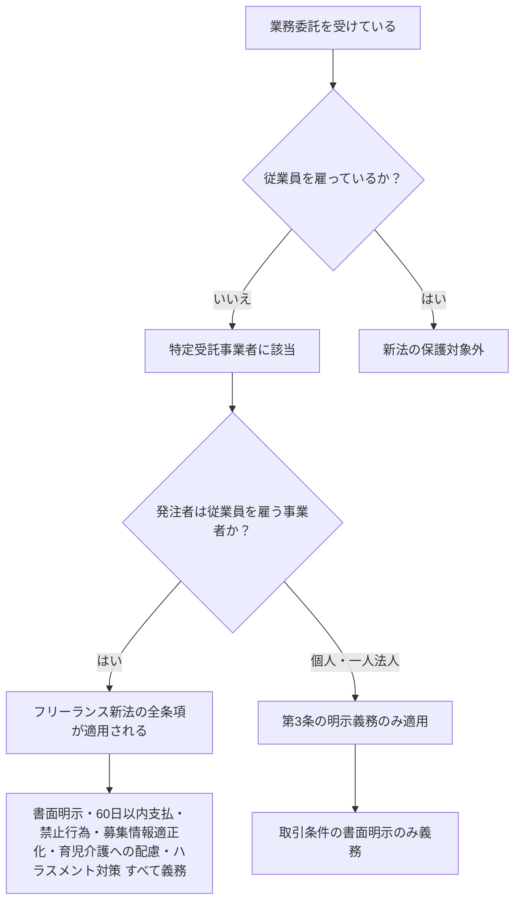

# 個人事業主とフリーランスの違い｜フリーランス新法の適用はどちらか

**メタディスクリプション：** 「自分はフリーランス新法の対象？」と疑問を持つあなたへ。個人事業主とフリーランスの定義の違いを条文根拠付きで解説。新法の適用条件と保護される権利を完全網羅します。

---

## 「自分はフリーランス新法に守られているのか？」

確定申告のために税務署で「個人事業主」として登録した。でも仕事の現場では「フリーランス」と名乗っている。この2つ、どこがどう違うのか、改めて聞かれると答えに詰まる人は多いはずです。

2024年11月に施行された**フリーランス・事業者間取引適正化等に関する法律（以下、フリーランス新法）**。ニュースで何度も目にしたけれど、「結局、自分には関係あるの？ないの？」という疑問を抱えたまま、今日も曖昧な契約書にサインしていませんか。

---

## 結論：「フリーランス」と「個人事業主」は重なるが、新法の対象は明確に定義されている

フリーランス新法が保護するのは、**「特定受託事業者」**です。これは「業務委託の相手方である事業者であって、従業員を使用しないもの」と定義されています（フリーランス新法第2条第1項）。

つまり、個人事業主であろうと法人であろうと、**従業員を雇っていない一人親方・一人法人**であれば新法の保護対象です。「フリーランス」という呼称は関係なく、「一人で仕事を請け負っているか」が判断基準です。

> **[→ 今の契約書の違反リスクを30秒で確認する（条文番号付きで違反箇所を特定）](https://freelance-contract-checker.vercel.app/pricing)**

---

## 「個人事業主」と「フリーランス」の定義を整理する

まず、この2つの言葉の意味を正確に区別します。

| 用語 | 定義 | 根拠・出所 |
|------|------|-----------|
| 個人事業主 | 法人を設立せず個人で事業を行う者 | 所得税法上の区分 |
| フリーランス | 特定の組織に属さず独立して働く者 | 一般的な慣習上の呼称 |
| 特定受託事業者 | 従業員を使用しない業務委託の受注者 | フリーランス新法第2条第1項 |

💡 <strong>ポイント</strong> 「個人事業主」は税法上の区分、「フリーランス」は働き方の呼称、「特定受託事業者」は新法上の法律用語です。この3つは意味が異なります。新法の保護を受けるには「特定受託事業者」に該当するかどうかが全てです。

### 具体的にどんな人が「特定受託事業者」に当たるか

- デザイナー・ライター・エンジニアなど、一人で業務委託を受けている個人事業主 ✅
- アルバイトや社員を1人も雇っていない一人株式会社の代表 ✅
- パートを1名でも雇用している個人事業主 ❌（従業員を使用しているため対象外）
- 会社員として働きながら副業で業務委託を受けている人 ✅（副業分の取引に適用）

---

## 新法が「特定受託事業者」に与える具体的な保護とは

フリーランス新法は、発注者（特定業務委託事業者）に対して複数の義務を課しています。

### ① 書面・電磁的方法による取引条件の明示義務

業務委託をする際、発注者は以下の事項を書面またはメール等で明示する義務があります（フリーランス新法第3条第1項）。

- 業務の内容
- 報酬の額
- 支払期日
- 給付を受領する期日または場所

口頭での依頼だけで仕事を進めるよう求めることは、この条文に違反します。

### ② 報酬の支払期日に関する規制

発注者が特定業務委託事業者（従業員を使用する事業者）である場合、業務委託の給付を受けた日から**60日以内**に報酬を支払う期日を設定する義務があります（フリーランス新法第4条）。

🚨 <strong>違反リスク</strong> 「検収後90日以内に支払う」「翌々月末払い」などの条項が60日を超えている場合、フリーランス新法第4条違反となります。発注者には行政指導・勧告・公表・命令・罰則の対象となるリスクがあります（同法第16条〜第22条）。

### ③ 禁止行為の明確化

発注者が特定業務委託事業者である場合、以下の行為が明示的に禁止されています（フリーランス新法第5条）。

- 受領拒否（第5条第1号）
- 報酬の減額（第5条第2号）
- 返品（第5条第3号）
- 買いたたき（第5条第4号）
- 購入・利用強制（第5条第5号）
- 不当な経済上の利益の提供要請（第5条第6号）
- 不当な給付内容の変更・やり直し（第5条第7号）

✅ <strong>チェックポイント</strong> 「修正は何度でも無料」「完成後に報酬を値引きされた」「発注者のツールやサービスを強制購入させられた」── これらは全てフリーランス新法第5条に基づく違反行為です。

> **[→ 契約書を500円でAI診断する（条文番号付きで違反箇所を特定）](https://freelance-contract-checker.vercel.app/pricing)**

---

## 新法が適用されるかどうかのフローチャート

自分が新法の保護対象かどうか、以下のフローで確認してください。

```mermaid
flowchart TD
    A[業務委託を受けている] --> B{従業員を雇っているか？}
    B -->|いいえ| C[特定受託事業者に該当]
    B -->|はい| D[新法の保護対象外]
    C --> E{発注者は従業員を雇う事業者か？}
    E -->|はい| F[フリーランス新法の全条項が適用される]
    E -->|個人・一人法人| G[第3条の明示義務のみ適用]
    F --> H[書面明示・60日以内支払・禁止行為・募集情報適正化・育児介護への配慮・ハラスメント対策 すべて義務]
    G --> I[取引条件の書面明示のみ義務]
```

⚠️ <strong>注意</strong> 発注者が個人事業主や一人法人の場合、適用される条項が限定されます。ただし、発注者が「従業員を使用する事業者（特定業務委託事業者）」であれば、第4条〜第13条の義務が全て課せられます。自分の発注者がどちらに当たるか確認することが重要です。

---

## 個人事業主・フリーランスが今すぐ確認すべき契約書の3つのポイント

新法の保護対象であることがわかった今、手元の契約書を確認します。以下の3点が記載されているかチェックしてください。

| 確認項目 | 新法の根拠 | NGの例 |
|---------|-----------|--------|
| 報酬額と支払期日の明記 | 第3条第1項 | 「別途協議」「適正な額」 |
| 支払期日が60日以内 | 第4条 | 「検収後90日以内」 |
| 一方的な修正・やり直し条項 | 第5条第7号 | 「甲の指示に従い何度でも修正する」 |

📋 <strong>まとめ</strong> ①「個人事業主」は税法の区分、「フリーランス」は働き方の呼称。新法の対象は「従業員を使用しない特定受託事業者」（第2条第1項）。②発注者が従業員を使う事業者なら、書面明示・60日支払・禁止行為規制がすべて適用される。③今すぐ契約書を確認し、違反条項がないか点検することが自分の権利を守る第一歩です。

---

## 今すぐできること1つ

手元にある業務委託契約書を開いてください。支払期日の欄を見てください。「60日を超えていないか」「報酬額が明記されているか」── この2点だけで、新法違反のリスクを大まかに判断できます。

しかし、すべての条文違反を自分でチェックするのは時間もかかり、見落としも起きます。AIを使った診断なら、契約書をアップロードするだけで条文番号付きの違反箇所レポートが500円で手に入ります。

> **[→ 500円で契約書を守る（専門知識不要・条文番号付きで違反箇所を特定）](https://freelance-contract-checker.vercel.app/pricing)**

自分がフリーランス新法で守られる立場であることを知った今日、契約書を守ることに投資する500円は、不当な値引きや報酬未払いから身を守る最小コストの行動です。