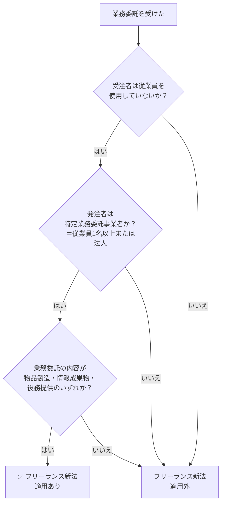

# 個人事業主とフリーランスの違い｜フリーランス新法の適用はどちらか

**メタディスクリプション：** 「自分はフリーランス新法の対象？」と迷う個人事業主・フリーランス向けに、法律が定める定義の違いと適用条件を条文番号付きで解説。契約トラブルを防ぐ具体的な確認方法も紹介。

---

## 「自分はフリーランス新法の対象なの？」と検索したあなたへ

確定申告で「個人事業主」として申告している。でも仕事のうえでは「フリーランス」と名乗っている。クライアントから送られてきた契約書には「業務委託」とだけ書かれていて、自分がフリーランス新法で保護される立場なのか、それとも対象外なのか、判断がつかないまま契約書にサインしてしまった——。

そういった状況に置かれているフリーランスは、日本全国に数十万人単位で存在します。税務上の呼び方と法律上の定義が異なるため、「個人事業主＝フリーランス」という単純な等号が成立しないのです。

---

## 結論：フリーランス新法の「適用対象」は業態ではなく、雇用関係の有無と受注形態で決まる

フリーランス新法（特定受託事業者に係る取引の適正化等に関する法律）は、**「特定受託事業者」に該当するかどうか**で適用の有無が決まります（フリーランス新法第2条第1項）。

税務署への開業届の有無や「フリーランス」という呼称は、法律上の適用判断には一切関係ありません。

> **[→ 登録不要・無料で契約書をAI診断する（条文番号付きで違反箇所を特定）](https://freelance-contract-checker.vercel.app/try)**

---

## 「個人事業主」と「フリーランス」は別の概念

まず、2つの言葉が指す範囲を整理します。

| 用語 | 定義される法律・制度 | 意味 |
|------|-------------------|----|
| 個人事業主 | 所得税法・国税通則法 | 法人を設立せず、個人で事業を営む者 |
| フリーランス | フリーランス新法第2条第1項 | 特定の事業者に雇用されず、業務委託を受ける個人・法人 |

**個人事業主**は「税務・社会保険上の分類」であり、開業届を出していれば誰でもなれます。一方、**フリーランス新法上の「特定受託事業者」**は、「業務委託の相手方である事業者のうち、従業員を使用しないもの」と定義されています（フリーランス新法第2条第1項）。

💡 <strong>ポイント</strong> 一人社長（法人）でも「従業員を使用しない」場合は、フリーランス新法の「特定受託事業者」に該当します（フリーランス新法第2条第1項）。個人事業主に限定されていません。

---

## フリーランス新法が適用される3つの条件

フリーランス新法が実際に機能するのは、以下の3条件がそろったときです。

### 条件①：受注者が「特定受託事業者」である

従業員を雇用していない個人または法人です（フリーランス新法第2条第1項）。パート・アルバイトを1人でも雇用している場合は、この定義から外れ「特定受託事業者」には該当しません。

### 条件②：発注者が「特定業務委託事業者」である

発注側が「従業員を使用する個人事業主」または「法人」であることが必要です（フリーランス新法第2条第3項）。個人が個人に依頼するケース（例：個人ブロガーがイラストレーターに1枚だけ発注）は、義務の対象外となる場面があります。

### 条件③：取引が「業務委託」である

雇用契約ではなく、業務委託契約（請負・準委任など）であることが必要です。形式が「業務委託」と書かれていても、実態が雇用に近い場合は別途「偽装フリーランス」の問題が生じます。

⚠️ <strong>注意</strong> 「個人事業主として開業届を出していない」場合でも、実態として従業員を雇わず業務委託で仕事を受けているなら、フリーランス新法の保護対象となります（フリーランス新法第2条第1項）。開業届の有無は関係ありません。

---

## 「適用あり」の場合、発注者には何の義務が課されるか

フリーランス新法が適用される取引では、発注者（特定業務委託事業者）に以下の義務が課されます。

| 義務の内容 | 根拠条文 | 違反した場合 |
|-----------|---------|------------|
| 書面・電磁的方法による取引条件の明示 | 第3条第1項 | 指導・助言・勧告・公表・命令の対象 |
| 報酬の支払期日の設定（60日以内） | 第4条 | 同上 |
| 募集情報の的確表示 | 第12条 | 同上 |
| ハラスメント対策措置 | 第14条 | 同上 |
| 契約解除の予告（30日前） | 第16条 | 同上 |

🚨 <strong>違反リスク</strong> 報酬の支払期日を「業務完了から60日以内」に設定しない契約書は、フリーランス新法第4条に違反します。発注者には公正取引委員会・中小企業庁・厚生労働省による行政指導・勧告が行われ、最終的には50万円以下の罰金が科されます（フリーランス新法第26条）。

> **[→ 今の契約書の違反リスクを30秒で確認する（登録不要・専門知識不要）](https://freelance-contract-checker.vercel.app/try)**

---

## 「自分はグレーゾーンかも」と思ったら確認すべき3点

適用判断に迷う典型的なパターンと判断基準をまとめます。

✅ <strong>チェックポイント</strong> 
①アルバイト・パートを雇っているか？　→ 雇っている場合は「特定受託事業者」に非該当 
②発注者は法人または従業員のいる個人事業主か？　→ 「特定業務委託事業者」の判断基準（第2条第3項） 
③契約形態は業務委託（請負・準委任）か？　→ 雇用契約なら労働法が適用

### よくある誤解ケース

**ケース1：「一人社長（合同会社）だから対象外では？」**
→ 従業員を使用していない法人も「特定受託事業者」に該当します（フリーランス新法第2条第1項）。法人格の有無は関係ありません。

**ケース2：「副業サラリーマンなので対象外では？」**
→ 本業で雇用されていても、副業分の業務委託取引については「特定受託事業者」として保護されます。副業での受注実態が判断基準です。

**ケース3：「開業届を出していないから対象外では？」**
→ 開業届は税務上の手続きであり、フリーランス新法の適用判断には影響しません（フリーランス新法第2条第1項）。

---

## 下請法との違い：二重に保護される場合もある

フリーランス新法に加えて、下請法（下請代金支払遅延等防止法）が同時に適用される取引も存在します。

下請法は資本金の規模で適用を判断し（下請法第2条）、フリーランス新法は雇用関係の有無で適用を判断します。一人社長（資本金1,000万円以下）が資本金1,000万円超の法人から業務委託を受ける場合は、**両法が同時に適用**されます。

💡 <strong>ポイント</strong> 下請法が適用される取引では、支払期日は「給付を受けた日から60日以内」と定められています（下請法第2条の2）。フリーランス新法の「業務委託を受けた日から60日以内」（第4条）と起算点が異なるため、両方の条件を満たす契約書の作成が必要です。

---

📋 <strong>まとめ</strong> 
・「個人事業主」は税務上の分類、「フリーランス新法の対象者」は別の定義（フリーランス新法第2条第1項） 
・開業届の有無・法人格の有無ではなく「従業員を雇っているか」が判断基準 
・発注者が法人または従業員のいる事業者なら、義務（書面明示・60日以内払い・30日前予告等）が発生 
・下請法と二重に適用されるケースもある

---

## 今すぐできること1つ：手元の契約書をAIに読ませる

「自分の契約書が新法に対応しているか」を確認するために、弁護士に相談する必要はありません。今すぐ、手元の契約書のPDFまたはテキストをAIに読み込ませることで、条文番号付きで違反箇所を特定できます。

フリーランス新法第3条・第4条・第16条への対応漏れは、受注者であるあなたが指摘しなければ、発注者が自ら気づくことはほぼありません。自分の権利は自分で守るしかないのが現実です。

> **[→ 無料で1回、契約書を守る（登録不要・専門知識不要）](https://freelance-contract-checker.vercel.app/try)**