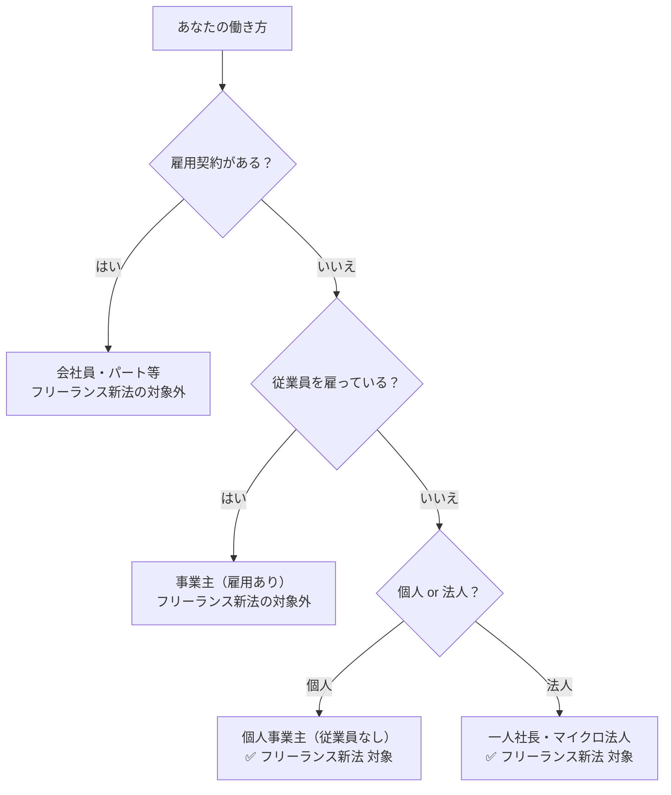

# 個人事業主とフリーランスの違い｜フリーランス新法の適用はどちらか

**メタディスクリプション：** 「自分はフリーランス新法の対象？」と悩む個人事業主・フリーランス必見。法律上の定義の違いと適用条件を条文番号付きで解説。契約書の違反リスクも無料AI診断で即確認できます。

---

## 「個人事業主って、フリーランス新法の対象になるの？」

確定申告を毎年自分でしている。名刺には「個人事業主」と書いてある。でも最近よく聞く「フリーランス新法」が自分に適用されるのかどうか、調べても「フリーランス」という言葉の定義があいまいでよくわからない——。

そんな状況で、クライアントから送られてきた業務委託契約書を前に、「これって法律違反じゃないの？」と感じながらも、どこに問い合わせればいいかわからず、結局サインしてしまった経験はないでしょうか。

結論から言います。**個人事業主であっても、フリーランスに該当します。**

---

## 結論：「個人事業主」と「フリーランス」は法的に別概念だが、新法上は重なる

「個人事業主」は**税務上・行政上の区分**であり、「フリーランス」は**働き方・取引形態上の区分**です。この2つは使われる文脈が異なります。

しかし、**フリーランス・事業者間取引適正化等に関する法律（フリーランス新法）**は、この両者を包含する形で「特定受託事業者」という概念を定義しています（フリーランス新法第2条第1項）。

> **[→ 登録不要・無料で契約書をAI診断する（条文番号付きで違反箇所を特定）](https://freelance-contract-checker.vercel.app/try)**

---

## フリーランス新法が定める「特定受託事業者」とは何か

フリーランス新法第2条第1項は、「特定受託事業者」を以下のように定義しています。

> **「業務委託の相手方である事業者であって、従業員を使用しないものをいう」**

つまり、法律上のカテゴリーは次の表のとおりです。

| 区分 | 定義の根拠 | フリーランス新法の適用 |
|---|---|---|
| 個人事業主（従業員なし） | 所得税法上の概念 | **対象（特定受託事業者）** |
| 個人事業主（従業員あり） | 所得税法上の概念 | **対象外** |
| 法人（一人社長・役員のみ） | 会社法上の概念 | **対象（特定受託事業者）** |
| 法人（従業員あり） | 会社法上の概念 | **対象外** |

**ポイントは「従業員の有無」だけです。**個人か法人かは問いません（フリーランス新法第2条第1項）。

💡 <strong>ポイント</strong> フリーランス新法における「フリーランス」の法律上の正式名称は「特定受託事業者」。個人事業主であっても従業員を雇っていなければ、この定義に該当し、新法の保護を受けます。

---

## 「個人事業主」と「フリーランス」の違いを整理する

日常用語としての違いを整理すると、以下のとおりです。

**個人事業主**：税務署に開業届を出し、個人として事業を行う者。確定申告の区分として使われる行政上の呼称です。

**フリーランス**：特定の企業に雇用されず、案件ごとに業務委託契約を結ぶ働き方。法律上の概念ではなく、慣用的な呼称です。

この2つは**「ほぼ同じ人を指す場合が多い」**ものの、厳密には以下のような図で整理されます。

このフローチャートが示すとおり、**従業員を雇っていない個人事業主は、すべてフリーランス新法の「特定受託事業者」に該当します**（フリーランス新法第2条第1項）。

⚠️ <strong>注意</strong> 「青色事業専従者」として家族に給与を払っている場合、その家族は「従業員」には該当しないケースがあります。ただし、社会保険に加入させている場合は従業員とみなされる可能性があるため、税理士への確認が必要です。

---

## 発注者側に課される義務：あなたの契約書は合法か

フリーランス新法は、特定受託事業者（フリーランス）への発注者（特定業務委託事業者）に対し、具体的な義務を課しています。

**業務委託をした際の書面交付義務**（フリーランス新法第3条）

発注者は、業務委託をする際に以下の事項を書面またはメールなどの電磁的方法で明示しなければなりません。

- 給付の内容
- 報酬の額
- 支払期日
- 発注事業者・受注者の名称

**報酬の支払期日の規制**（フリーランス新法第4条）

業務委託の報酬は、給付を受領した日から**60日以内**に支払う期日を定めなければなりません。かつ、できる限り短い期間を設定する義務があります（フリーランス新法第4条第1項）。

🚨 <strong>違反リスク</strong> 「検収後90日払い」「翌々月末払い」などの条件が契約書に書かれている場合、フリーランス新法第4条違反となります。発注者には公正取引委員会・中小企業庁による勧告・公表・命令の対象となります（フリーランス新法第16条・第17条）。

> **[→ 今の契約書の違反リスクを30秒で確認する（登録不要・無料）](https://freelance-contract-checker.vercel.app/try)**

---

## 継続的取引に発生する追加義務

発注者が同一のフリーランスに**継続的に業務委託をする場合**（期間1ヶ月以上）、さらに以下の義務が加わります（フリーランス新法第5条）。

✅ <strong>チェックポイント：継続取引で発注者に課される義務（第5条）</strong> 
・ハラスメント対策のための体制整備（第5条第6号） 
・育児・介護等と業務の両立への配慮（第5条第7号） 
・中途解除・条件変更の30日前予告（第5条第4号） 
・不当な給付内容の変更・やり直し要求の禁止（第5条第1号） 
・買いたたき・一方的な報酬減額の禁止（第5条第3号）

特に**30日前予告なしの一方的な契約解除**は、フリーランス新法第5条第4号の違反となります。「急に仕事を切られた」という状況が法律上明示的に規制されているのです。

---

## 今すぐできること1つ

あなたが従業員を雇っていない個人事業主であれば、**今日から即座にフリーランス新法の保護対象です**。

次にすべきことは1つだけです。**今手元にある業務委託契約書が、フリーランス新法に違反していないかを確認すること**。

報酬の支払期日は60日以内に収まっているか（第4条）、業務内容・報酬額・支払期日が書面で明示されているか（第3条）、一方的な解除条項が含まれていないか（第5条第4号）——これらを1つずつ読み込むのは時間がかかります。

📋 <strong>まとめ</strong> 
・個人事業主＝税務上の区分、フリーランス＝働き方の区分（日常用語） 
・フリーランス新法上は「従業員なし事業者＝特定受託事業者」として両者を包含（第2条第1項） 
・発注者には書面交付義務（第3条）・60日以内払い義務（第4条）が課される 
・継続取引では解除の30日前予告・買いたたき禁止等が追加される（第5条） 
・違反発注者は勧告・公表・命令の対象（第16条・第17条）

AI診断ツールなら、契約書をアップロードするだけで条文番号付きの違反箇所を自動で特定します。登録不要・無料・30秒で完了します。

> **[→ 無料で1回、契約書を守る（登録不要・専門知識不要）](https://freelance-contract-checker.vercel.app/try)**