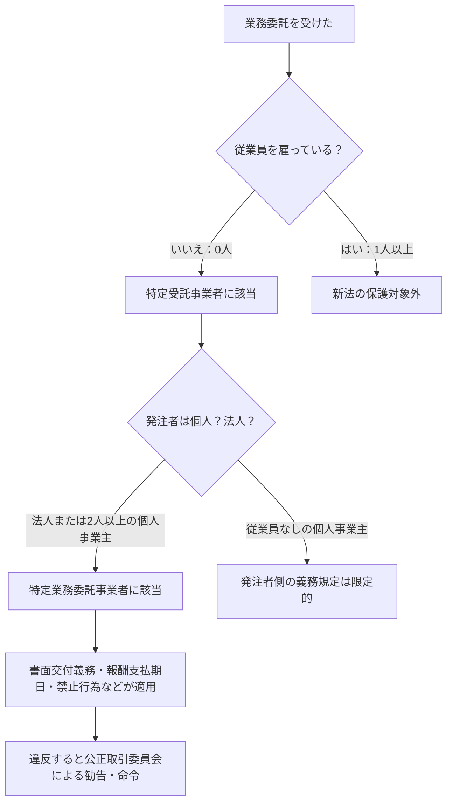

# 個人事業主とフリーランスの違い｜フリーランス新法の適用はどちらか

**メタディスクリプション：** 「自分はフリーランス新法の対象？」と迷う個人事業主・フリーランス必見。法律上の定義の違いと適用条件を条文番号付きで解説。契約書の違反リスクも無料AI診断で確認できます。

---

## 「自分はフリーランス新法の対象なの？」と思ったあなたへ

確定申告で「事業所得」として申告している。名刺には「フリーランスデザイナー」と書いている。でも開業届は出していない——。

こうした状況で「フリーランス新法が施行されたらしいけど、自分は守られるの？」と調べ始めると、「個人事業主」「フリーランス」「特定受託事業者」といった言葉が入り乱れ、どれが自分に当てはまるのか分からなくなる人が続出しています。

この混乱には理由があります。税務上・法律上・慣習上での「個人事業主」と「フリーランス」の定義がバラバラだからです。この記事では、フリーランス新法（特定受託事業者に係る取引の適正化等に関する法律）の条文を根拠に、どちらが新法の保護を受けられるのかを断定的に解説します。

---

## 結論：フリーランス新法が守るのは「従業員を使っていない事業者」

フリーランス新法の保護対象は、税務上の「個人事業主か否か」ではなく、**「従業員を雇っているかどうか」**で決まります。

フリーランス新法第2条第1項は、保護対象を「**特定受託事業者**」と定義し、「業務委託の相手方である事業者であって、従業員を使用しないもの」と明確に規定しています。つまり、開業届の有無・屋号の有無・法人格の有無は関係ありません。**従業員を1人でも雇った瞬間に、この法律の保護対象から外れます。**

> **[→ 登録不要・無料で契約書をAI診断する（条文番号付きで違反箇所を特定）](https://freelance-contract-checker.vercel.app/try)**

---

## 「個人事業主」と「フリーランス」は何が違うのか

### 税務・法律・慣習での定義の違い

| 区分 | 定義する場面 | 定義の内容 |
|------|------------|-----------|
| 個人事業主 | 税務（所得税法） | 事業所得を得る個人。開業届提出が推奨されるが必須ではない |
| フリーランス | 慣習・一般用語 | 法的定義なし。「組織に属さず個人で働く人」という社会通念 |
| 特定受託事業者 | フリーランス新法第2条 | 従業員を使用しない事業者（個人・法人を問わず） |

重要なのは、**「フリーランス」という言葉は法律上の用語ではない**という点です。フリーランス新法という名称を持ちながら、法文の中に「フリーランス」という単語は存在しません。法律が守るのは「特定受託事業者」という概念です。

### 個人事業主でもフリーランス新法が適用されないケース

以下のいずれかに当てはまる場合、フリーランス新法の「特定受託事業者」には該当しません（フリーランス新法第2条第1項）。

🚨 <strong>違反リスク</strong> 
従業員（パート・アルバイトを含む）を1人でも雇用している個人事業主は「特定受託事業者」に該当しないため、フリーランス新法の保護は受けられません。一方で発注者側の義務規定も適用されません。

### 一人会社（マイクロ法人）はどうなるか

従業員を雇っていない一人会社（法人）も「特定受託事業者」に該当します（フリーランス新法第2条第1項）。法人格があっても、従業員ゼロであれば保護対象です。個人事業主かどうかという税務上の区分は、新法の適用判断に一切関係ありません。

---

## フリーランス新法が「発注者」に課す義務の全体像

自分が保護対象（特定受託事業者）だと分かったら、次に「発注者がどんな義務を負うか」を把握することが重要です。

### 発注者に課される主な義務（条文根拠）

| 義務の種類 | 条文 | 内容 |
|-----------|------|------|
| 書面等の交付義務 | 第5条 | 業務内容・報酬・支払期日などを書面で明示 |
| 報酬支払期日の設定 | 第6条 | 給付受領日から60日以内に支払期日を設定 |
| 禁止行為 | 第12条 | 発注取消・報酬減額・返品・買いたたき等の禁止 |
| ハラスメント対策 | 第14条 | セクハラ・パワハラ防止措置の実施義務 |
| 育児・介護への配慮 | 第13条 | 申し出があった場合の配慮義務 |

💡 <strong>ポイント</strong> 
フリーランス新法第5条第1項が定める書面交付義務は、口頭での合意や「いつもの条件で」という慣習的な発注では満たせません。業務ごとに書面（電子メール・PDF等）での明示が必要です。

> **[→ 今の契約書の違反リスクを30秒で確認する（登録不要・専門知識不要）](https://freelance-contract-checker.vercel.app/try)**

---

## 開業届を出していないフリーランスは対象外か？

「開業届を出していないから保護されないのでは」と不安に思う人は多いですが、**開業届の提出はフリーランス新法の適用要件に含まれていません**。

フリーランス新法第2条第1項は「事業者であって、従業員を使用しないもの」と定めており、税務署への登録状況を問いません。継続・反復して業務を受託して報酬を得ている実態があれば、届出の有無にかかわらず「特定受託事業者」に該当します。

✅ <strong>チェックポイント</strong> 
以下をすべて満たせば、開業届なしでもフリーランス新法の保護を受けられます。 
・継続・反復して業務委託を受けている 
・報酬を得ている（またはこれから得る予定） 
・従業員を1人も雇っていない

---

## 下請法との適用関係：どちらが優先されるか

フリーランス新法と下請法（下請代金支払遅延等防止法）は並存して適用されます。ただし適用要件が異なります。

下請法は発注者と受注者の「資本金規模の差」によって適用が決まります（下請法第2条）。一方、フリーランス新法は資本金規模ではなく「受注者が従業員を使っているかどうか」で適用が決まります。

**下請法が適用されない取引**（例：資本金1000万円以下の法人からの発注）でも、フリーランス新法の保護は受けられます。この点でフリーランス新法は下請法の「網の目をすり抜けていた取引」を補完する機能を持っています。

⚠️ <strong>注意</strong> 
下請法の適用がある取引では、下請法の義務がフリーランス新法の義務に上乗せされます。両方の義務を同時に果たす必要があるため、発注担当者は両法を必ずセットで確認してください。

---

## 契約書に「書くべきこと」が書いてあるか確認する

フリーランス新法第5条第1項が求める書面記載事項は以下の通りです。

1. 業務委託の内容
2. 報酬の額
3. 支払期日
4. 発注者・受注者の名称
5. 業務委託をした日
6. 給付を受領する日（業務の締切・納品日）
7. 給付を受領する場所
8. 検査の有無および完了期日
9. 報酬の支払い方法

この9項目のうち1つでも欠けていると、発注者は**フリーランス新法第5条違反**となり、公正取引委員会からの報告徴収・勧告・命令の対象になります（フリーランス新法第25条・第26条）。

📋 <strong>まとめ</strong> 
・「個人事業主か否か」より「従業員を雇っているか否か」がフリーランス新法の適用基準（第2条第1項） 
・開業届・屋号・法人格は適用要件に無関係 
・一人会社でも従業員なしなら保護対象 
・契約書に9項目が揃っていないと発注者は違反（第5条第1項） 
・下請法との適用は並存し、要件が異なる

---

## 今すぐできること1つ：今の契約書を診断する

「自分はフリーランス新法の対象だった」と分かったとしても、手元の契約書がその保護を正しく反映していなければ意味がありません。

発注者が書面交付義務（フリーランス新法第5条）を果たしていない契約書、報酬支払期日が60日を超えている契約書（第6条）、禁止行為に該当する条項が入っている契約書（第12条）——これらはすべて違法状態です。しかし専門知識がなければ見抜けません。

今すぐできることは**契約書を1回、AI診断にかけること**です。登録不要・無料・30秒で、条文番号付きの違反リスクレポートが出ます。

> **[→ 無料で1回、契約書を守る（登録不要・専門知識不要）](https://freelance-contract-checker.vercel.app/try)**

「自分はフリーランス新法の対象だったのか」が分かったその足で、今の契約書が法律を満たしているかを確認してください。それが、新法施行後の時代に自分の仕事と報酬を守る最初の一歩です。